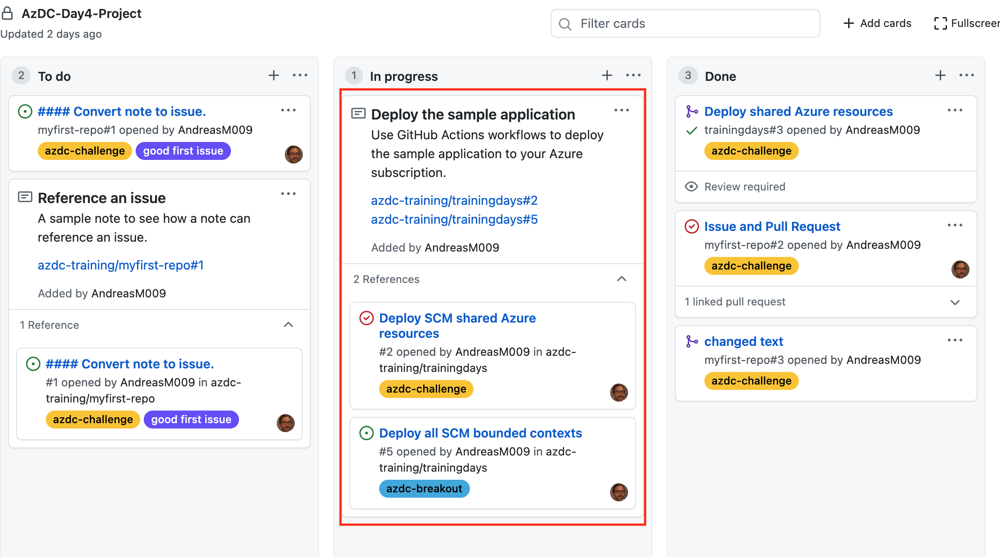
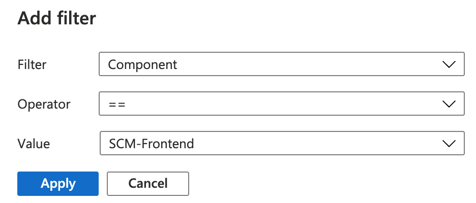
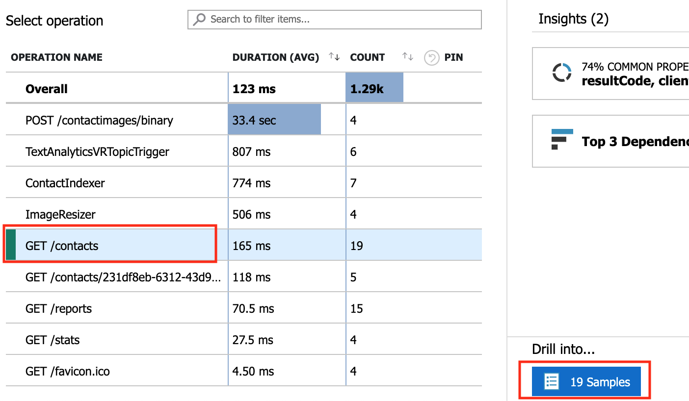
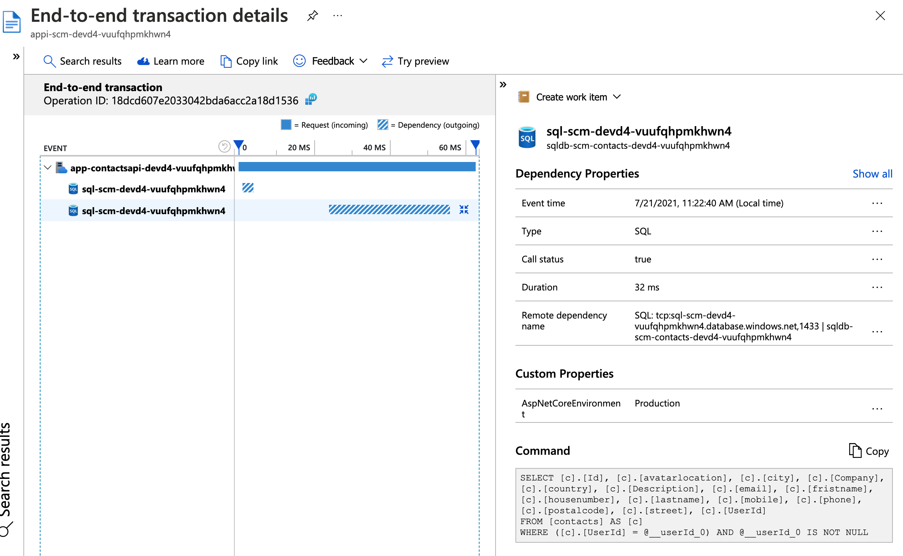
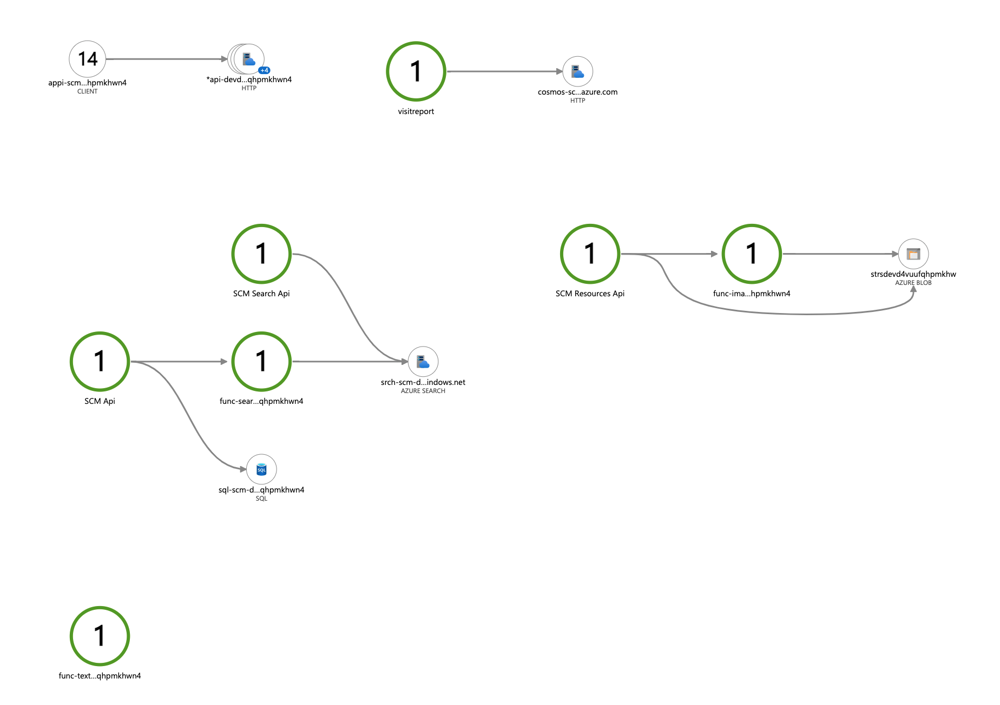

# 💎 Breakout 1:  Deploy the sample application with GitHub workflows 💎

⏲️ *Est. time to complete: 60 min.* ⏲️

## Here is what you will learn 🎯

We have already seen how to create a professional CI/CD workflow with GitHub Actions workflows. Although we have only deployed the shared Azure resources of the sample application so far, we have learned all necessary things to deploy the other bounded contexts to a development and testing environment. 

In this challenge you will learn how to:

- deploy all bounded contexts of the sample application
- see Azure resource tags in action
- add data to the sample application

## Table of contents

1. [Plan your work](#plan-your-work)
2. [Prepare the workflows](#prepare-the-workflows)
3. [Create and merge the Pull Request](#create-and-merge-the-pull-request)
4. [Add data to the sample application and inspect ApplicationInsights](#add-data-to-the-sample-application-and-inspect-applicationinsights)

## Plan your work

As in the previous challenges we want to reflect our work for the breakout session on the project board.
We have already created a _note_ on our project board, which says:
_Deploy the sample application_

To describe the outstanding work for this breakout session, we create the following issue in the imported trainingdays repository, assign the label `azdc-breakout` and link it to the _note_:

```text
Deploy all SCM bounded contexts

Prepare GitHub Actions workflows to deploy all SCM bounded contexts.
Deploy all bounded contexts to a development and testing environment.
```

After this is done, the project board should look like this:



## Prepare the workflows 

Now we have to prepare all extsing workflows. As we pushed changes to the master branch in the previous challenge, we need to pull these changes first:

```shell
git checkout master
git pull
```

Then we create a new feature branch for the outstanding work:

```shell
git branch cicd/all
git checkout cicd/all

# or
git checkout -b cicd/all
```

Now we need to replace the organisation name in each job condition of the following workflows:

- day4-scm-contactsapi.yml
- day4-scm-frontend.yml
- day4-scm-resourcesapi.yml
- day4-scm-searchapi.yml
- day4-scm-visitreports.yml

:::tip

📝 In total, five files must be changed. You can check this with the `git status`command:

```shell
git status
On branch cicd/all
Changes not staged for commit:
  (use "git add <file>..." to update what will be committed)
  (use "git restore <file>..." to discard changes in working directory)
	modified:   .github/workflows/day4-scm-contactsapi.yml
	modified:   .github/workflows/day4-scm-frontend.yml
	modified:   .github/workflows/day4-scm-resourcesapi.yml
	modified:   .github/workflows/day4-scm-searchapi.yml
	modified:   .github/workflows/day4-scm-visitreports.yml

no changes added to commit (use "git add" and/or "git commit -a")
```
:::

After this is done, commit and push the changes:

```shell
git add .
git commit -m "activate day4 workflows"
git push --set-upstream origin cicd/all
```

## Create and merge the Pull Request

Create a pull request to push the changes to the master branch. Close the issue _Deploy all SCM bounded contexts_ with the pull request.
After the pull request is created, wait for all status checks and merge the pull request.

After the pull request is merged, navigate to the `Àctions` page and observe the workflows.

## Add data to the sample application and inspect ApplicationInsights

After everything is deployed, we want to add some data to the application in the development environment. Navigate to the Azure portal and go to the resource group for the development environment. The name of the resource group starts with `rg-scm-devday4-` and end with your GitHub organization name `rg-scm-devday4-<your organization name>`. We need to find the storage account where the frontend is hosted in a static website. The deployment created some Azure `Tags` to group the used Azure resources regarding their bounded context. Within the resource group you can set filters in the `Resources` details view. 

Apply the following filter:



As a result we see one storage account. Open the storage account and go to the section `Static website`. Here you can find the primary endpoint of the frontend in the development environment. Copy the URL and open the frontend in your browser.

Now add some test data: 
- add some contacts with images
- add VisitReports
- add VisitResults

After adding the data, let's have a look at ApplicationInsights. Back in the Azure portal, open the ApplicationInsights instance of your development environment `rg-scm-devday4-<your organization name>`. In the `overview` page we can already see some useful information about our application in the following diagrams:
- Failed requests
- Server response time
- Server requests
- Availability (if we had added Availability test)

We can click on a diagram to drill down and get more detailed information. Let's see what details we get, when we cklick on the `Server response time` diagram.
Take some time and investigate which metrics are provided in the Performance View of ApplicationInsights.

Check the metrics for:
- Operations
- Dependencies
- Roles


Now, let's check the samples for the server operation `GET/contacts`. Select the `Operations` metrics and the `GET/contacts` opreation in the list.
Drill into the provided samples:



Select a sample and look at the dependency calls:



Here you can see all calls to external services, such as SQL Database. 
If you want to learn more about cross-component transaction, have a look at the documentation [here](https://docs.microsoft.com/azure/azure-monitor/app/transaction-diagnostics)

Now, navigate to the `Application Map` of your ApplicationInsights instance. Here you can see the full application topology across multiple levels of related application components.



If you want to learn more about the `Application Map` have a look at the documentation [here](https://docs.microsoft.com/azure/azure-monitor/app/app-map?tabs=net)

## Congratulation

🥳 **Congratulation** - You've done it! 🥳

[◀ Previous challenge](./05-challenge-common-cicd.md) | [🔼 Day 4](../README.md) |