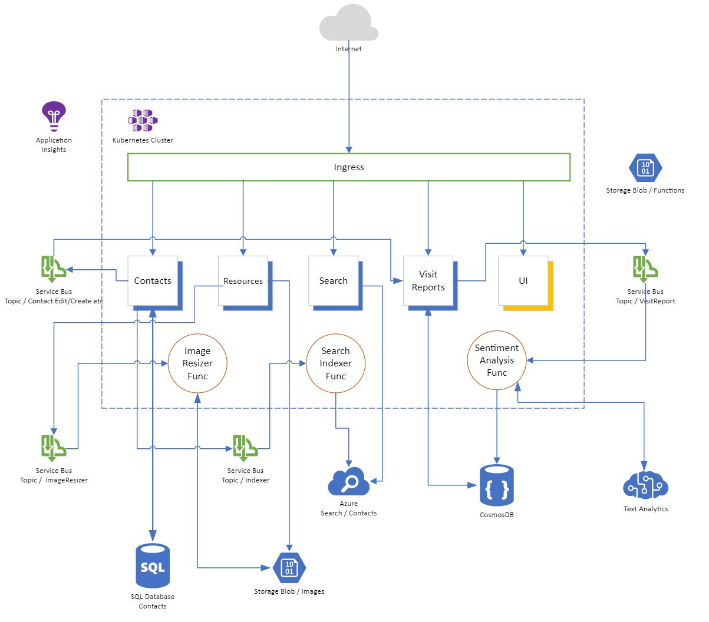
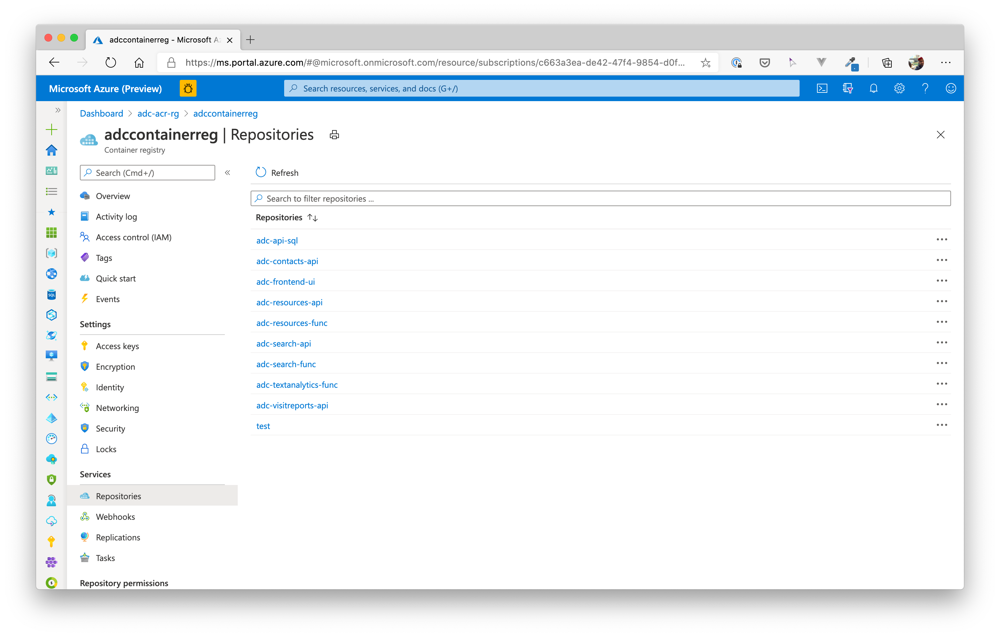
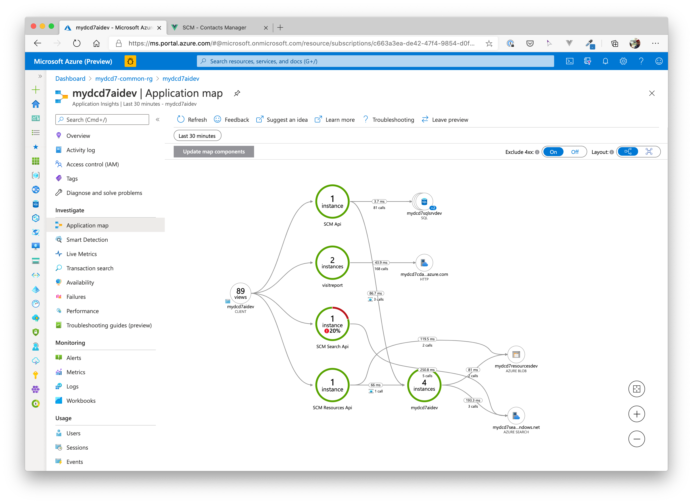
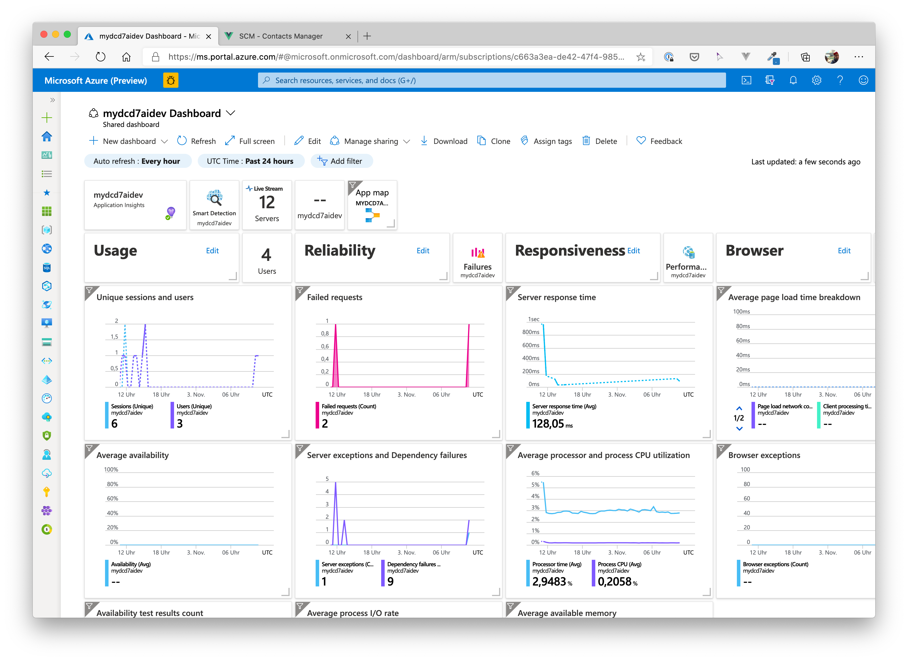

# Challenge 4: Deploy a Microservice-Oriented Sample Application

## Here is what you will learn 🎯

In this challenge you will apply what you have learned in the previous challenges to our Contacts API i.e. you will deploy the Simple Contacts Management (SCM) application to your Kubernetes cluster.

# Table Of Contents

1. [Architecture](#architecture)
2. [Terraform - Deploy Azure Infrastructure](#terraform-deploy-azure-infrastructure)
3. [Deploy Configuration / Secrets](#deploy-configuration-secrets)
4. [Build all required Docker Images](#build-all-required-docker-images)
5. [Deploy Backend APIs](#deploy-backend-apis)
6. [Deploy Functions / Daemon Services](#deploy-functions-daemon-services)
7. [Deploy UI](#deploy-ui)
8. [Check](#check)
9. [Monitoring (Optional)](#monitoring-optional)
10. [Wrap-Up](#wrap-up)

## Architecture

We have been working with the Contacts API now for some time. Let's deploy the "full-blown" Simple Contacts Management (SCM) app to your Kubernetes cluster.

To give you an impression how this will look like in the end, here are some screenshots:


The application is capable managing contacts and visit reports via a modern, responsive UI that is written in [VueJS](https://vuejs.org).

It makes use of several Azure services to have a good UX, e.g. indexing contacts in an [Azure Search service](https://docs.microsoft.com/azure/search/search-what-is-azure-search) to give users the possibility to search for contacts anywhere in the app, send visit report results to an [Azure Congitive Service](https://docs.microsoft.com/azure/cognitive-services/text-analytics/) instance to analyze the sentiment of the result description etc.

We also followed a microservice approach by giving each service its own data store ([Azure SQL DB](https://docs.microsoft.com/azure/azure-sql/) for contacts service, [Cosmos DB](https://docs.microsoft.com/azure/cosmos-db/) for visit reports service etc.).

Under the hood, services communicate with each other by sending messages over an [Azure Service Bus](https://docs.microsoft.com/azure/service-bus-messaging/) instance via several topics so that we can guarantee that each services operates on its own. Some of these messages are also handled by "background/daemon"-services which we implemented by using the [Azure Functions runtime](https://docs.microsoft.com/azure/azure-functions/functions-create-function-linux-custom-image?tabs=bash%2Cportal&pivots=programming-language-csharp) - yes, you can host Azure Functions via Docker containers (see [Create a function on Linux using a custom container](https://docs.microsoft.com/azure/azure-functions/functions-create-function-linux-custom-image?tabs=bash%2Cportal&pivots=programming-language-csharp) for details)!

That said, we are also following the best practice to push all possible state of the application out of your cluster. That means, we won't host any database within the cluster. Stateless clusters are much easier to manage!

This is how the architecture looks like after deploying Azure and in-cluster services:



## Terraform - Deploy Azure Infrastructure

To create the Azure infrastructure, we are using [Terraform](https://www.terraform.io/), a very popular tool in the "Infrastructure-as-Code" space.

::: tip
📝 If you haven't installed it already, please follow the official tutorial: <https://www.terraform.io/downloads.html>.
:::

If you have successfully installed the Terrraform CLI, let's create the Azure service, we need.

Go to folder `day7/challenges/samples/challenge-4/0_tf` and open the file `variables.tf`. You need to adjust a few settings:

- default value of `location` - choose the same location as your AKS cluster to create all services in the same location
- default value of `prefix` - we use a prefix to have consistent naming of services. Please choose one that fits for you, but be careful to **not** use more than **6** characters for it.

You can leave all other variables with their default values. The file should then look similar to that:

```hcl
variable "location" {
  type    = string
  default = "westeurope"
}

variable "prefix" {
  type    = string
  default = "mydcd7"
  validation {
    condition     = length(var.prefix) <= 6
    error_message = "The prefix value must not be longer than 6 characters."
  }
}

variable "env" {
  type    = string
  default = "dev"
}

variable "cosmosdbname" {
  type    = string
  default = "scmvisitreports"
}

variable "cosmoscontainername" {
  type    = string
  default = "visitreports"
}

variable "sqldbusername" {
  type    = string
  default = "adcsqladmin"
}

variable "sqldbpassword" {
  type    = string
  default = "Ch@ngeMe!123!"
}
```

After adjusting the file, you can execute the following commands (in folder `day7/challenges/samples/challenge-4/0_tf`):

```shell
$ terraform init
$ terraform apply
# Answer with 'yes' when asked, that the changes will be applied.
```

::: tip
📝 If you get an error because of the validation section in the `variables.tf` file, you probably used an older version of `terraform`. If you don't want to update to a newer version, just remove that section.
:::

**This will take up to 20 minutes to finish** - grab a coffee ☕

After the script has successfully finished, save the variables/secrets from Azure to a file:

```shell
terraform output -json > azure_output.json
```

## Create a new Kubernetes Namespace

We will put our application into a namespace called `contactsapp`. Let's create it:

```shell
$ kubectl create ns contactsapp

namespace/contactsapp created
```

We set the new namespace as the current _default one_. Otherwise, we would always have to append `--namespace contactsapp` to our commands:

```shell
$ kubectl config set-context --current --namespace=contactsapp

Context "adc-cluster" modified.

# to reset the namespace later back to 'default', use 'kubectl config set-context --current --namespace=default'
```

## Deploy Configuration / Secrets

Now we have to create two configuration objects that we use to read the Azure configuration within the Kubernetes cluster: a `Secret` and a `ConfigMap`.

Go to `day7/challenges/samples/challenge-4/1_config` and replace the placeholders `#{var_name}#` in the file `secrets.yaml` with the corresponding value from the `azure_output.txt` file.

::: tip
📝 There is a bash script called `replace_variables.sh` in the same directory that you can use to automatically create the `ConfigMap` and `Secret` file for you.

**Prerequisite:** You need the [jq](https://stedolan.github.io/jq/) tool installed in the environment you are running the script. If you are using Azure Shell, you are good to go.

Just run it and it will produce two files called `local-configmap.yaml` and `local-secrets.yaml` (the script will keep the original files untouched). Use the `local` versions for deployment:
:::

```yaml
apiVersion: v1
kind: Secret
metadata:
  name: scmsecrets
type: Opaque
data:
  'APPINSIGHTSKEY': '#{appinsights_base64}#'
  'CONTACTSLISTENCONNSTR': '#{contacts_listen_connectionstring_base64}#'
  'CONTACTSLISTENENTITYCONNSTR': '#{contacts_listen_with_entity_connectionstring_base64}#'
  'CONTACTSSENDCONNSTR': '#{contacts_send_connectionstring_base64}#'
  'COSMOSENDPOINT': '#{cosmos_endpoint_base64}#'
  'COSMOSPRIMARYKEY': '#{cosmos_primary_master_key_base64}#'
  'RESOURCESCONNECTIONSTRING': '#{resources_primary_connection_string_base64}#'
  'FUNCTIONSCONNECTIONSTRING': '#{funcs_primary_connection_string_base64}#'
  'SEARCHNAME': '#{search_name_base64}#'
  'SEARCHPRIMARYKEY': '#{search_primary_key_base64}#'
  'SQLDBCONNECTIONSTRING': '#{sqldb_connectionstring_base64}#'
  'TAENDPOINT': '#{textanalytics_endpoint_base64}#'
  'TAKEY': '#{textanalytics_key_base64}#'
  'THUMBNAILLISTENCONNSTR': '#{thumbnail_listen_connectionstring_base64}#'
  'THUMBNAILSENDCONNSTR': '#{thumbnail_send_connectionstring_base64}#'
  'VRLISTENCONNSTR': '#{visitreports_listen_connectionstring_base64}#'
  'VRSENDCONNSTR': '#{visitreports_send_connectionstring_base64}#'
```

::: warning
⚠️ The value of a variable should **not contain** the opening/closing tags anymore, e.g. `'APPINSIGHTSKEY': '1234567890'`.
:::

Do the same with the file `configmap.yaml`:

```yaml
kind: ConfigMap
apiVersion: v1
metadata:
  name: uisettings
data:
  settings.js: |-
    var uisettings = {
      endpoint: '/api/contacts/',
      resourcesEndpoint: '/api/resources/',
      searchEndpoint: '/api/search/',
      reportsEndpoint: '/api/visitreports/',
      enableStats: true,
      aiKey: '#{appinsights}#',
    }
```

::: tip
📝 Be careful: in this `ConfigMap` the AppInsights Key (`aiKey`) is **not** the base64-encoded one!
:::

Please apply both files to your cluster. If you ran the `replace_variables.sh` script, the files are `local-configmap.yaml` and `local-secrets.yaml`:

```shell
$ kubectl apply -f configmap.yaml
configmap/uisettings created

$ kubectl apply -f secrets.yaml
secret/scmsecrets created
```

## Build all required Docker images

Now we need to build all Docker images for our application. In total, we will have **8** images in our repository after this task. For convenience reasons, we build all images in the container registry!

Now, build all the required images one by one.

Therefore first create a shell variable `ACR_NAME` with the name of your container registry like this:

```shell
ACR_NAME=yourRegistryNameHere
```

This variable is used for all the following Docker builds in ACR. Go to the root directory of the repository `trainingdays` and fire all docker builds one after another:

1. Contacts API:

```shell
az acr build -r $ACR_NAME -t $ACR_NAME.azurecr.io/adc-contacts-api:2.0 -f ./day7/apps/dotnetcore/Scm/Adc.Scm.Api/Dockerfile ./day7/apps/dotnetcore/Scm
```

2. Resources API:

```shell
az acr build -r $ACR_NAME -t $ACR_NAME.azurecr.io/adc-resources-api:2.0 ./day7/apps/dotnetcore/Scm.Resources/Adc.Scm.Resources.Api
```

3. Image Resizer Function:

```shell
az acr build -r $ACR_NAME -t $ACR_NAME.azurecr.io/adc-resources-func:2.0 ./day7/apps/dotnetcore/Scm.Resources/Adc.Scm.Resources.ImageResizer
```

4. Search API:

```shell
az acr build -r $ACR_NAME -t $ACR_NAME.azurecr.io/adc-search-api:2.0 ./day7/apps/dotnetcore/Scm.Search/Adc.Scm.Search.Api
```

5. Search Indexer Function:

```shell
az acr build -r $ACR_NAME -t $ACR_NAME.azurecr.io/adc-search-func:2.0 ./day7/apps/dotnetcore/Scm.Search/Adc.Scm.Search.Indexer
```

6. Visit Reports API:

```shell
az acr build -r $ACR_NAME -t $ACR_NAME.azurecr.io/adc-visitreports-api:2.0 ./day7/apps/nodejs/visitreport
```

7. Text Analytics Function:

```shell
az acr build -r $ACR_NAME -t $ACR_NAME.azurecr.io/adc-textanalytics-func:2.0 ./day7/apps/nodejs/textanalytics
```

8. Frontend / UI:

```shell
az acr build -r $ACR_NAME -t $ACR_NAME.azurecr.io/adc-frontend-ui:2.0 ./day7/apps/frontend/scmfe
```

Now, all images are present in your container registry. You can check the repositories in the portal, if you want:



## Deploy Backend APIs

We are now all set to deploy the services to the Kubernetes cluster.

But first, we need to do some clean-up. We created ingress definitions in [challenge 2](./challenge-2.md#create-ingress-definitions) that would now interfere with the ones we will be creating in this challenge.

So let's clean up these old ingress definitions:

```shell
kubectl delete ingress ing-frontend -n default
kubectl delete ingress ing-contacts -n default
```

We are ready to deploy the API services (contacts, resources, search, visitreport APIs) to the cluster now. Each of these services comprises a `Deployment`, a `ClusterIP Service` and an `Ingress` definition.

::: tip
📝 For each service, you need to adjust some variables in the predefined YAML manifests. So please carefully read the hints in each API section.
:::

### Contacts API

Go to folder `day7/challenges/samples/challenge-4/2_apis` and adjust the `ca-deploy.yaml` and `ca-ingress.yaml` as described below.

Settings to adjust:

| File            | Setting            | Hint                                                                                            |
| --------------- | ------------------ | ----------------------------------------------------------------------------------------------- |
| ca-deploy.yaml  | <ACR_NAME>         | Replace with the name of your Azure Container Registry, e.g. in our case here `adccontainerreg` |
| ca-ingress.yaml | #{YOUR_HOST_NAME}# | Replace with the nip.io domain name, e.g. `20-67-122-249.nip.io`                                |

Apply the definitions in the mentioned path:

```shell
$ kubectl apply -f 1_contactsapi

deployment.apps/ca-deploy created
ingress.extensions/ing-contacts created
service/contactsapi created
```

### Resources API

Go to folder `day7/challenges/samples/challenge-4/2_apis`and adjust the `resources-deploy.yaml` and `resources-ingress.yaml` as described below.

Settings to adjust:

| File                   | Setting            | Hint                                                                                            |
| ---------------------- | ------------------ | ----------------------------------------------------------------------------------------------- |
| resources-deploy.yaml  | <ACR_NAME>         | Replace with the name of your Azure Container Registry, e.g. in our case here `adccontainerreg` |
| resources-ingress.yaml | #{YOUR_HOST_NAME}# | Replace with the nip.io domain name, e.g. `20-67-122-249.nip.io`                                |

Apply the definitions in the mentioned path:

```shell
$ kubectl apply -f 2_resourcesapi

deployment.apps/resources-deploy created
ingress.extensions/ing-resources created
service/resourcesapi created
```

### Search API

Go to folder `day7/challenges/samples/challenge-4/2_apis` and adjust the `search-deploy.yaml` and `search-ingress.yaml` as described below.

Settings to adjust:

| File                | Setting            | Hint                                                                                            |
| ------------------- | ------------------ | ----------------------------------------------------------------------------------------------- |
| search-deploy.yaml  | <ACR_NAME>         | Replace with the name of your Azure Container Registry, e.g. in our case here `adccontainerreg` |
| search-ingress.yaml | #{YOUR_HOST_NAME}# | Replace with the nip.io domain name, e.g. `20-67-122-249.nip.io`                                |

Apply the definitions in the mentioned path:

```shell
$ kubectl apply -f 3_searchapi

deployment.apps/search-deploy created
ingress.extensions/ing-search created
service/searchapi created
```

### Visit Reports API

Go to folder `day7/challenges/samples/challenge-4/2_apis` and adjust the `visitreports-deploy.yaml` and `visitreports-ingress.yaml` as described below.

Settings to adjust:

| File                      | Setting            | Hint                                                                                            |
| ------------------------- | ------------------ | ----------------------------------------------------------------------------------------------- |
| visitreports-deploy.yaml  | <ACR_NAME>         | Replace with the name of your Azure Container Registry, e.g. in our case here `adccontainerreg` |
| visitreports-ingress.yaml | #{YOUR_HOST_NAME}# | Replace with the nip.io domain name, e.g. `20-67-122-249.nip.io`                                |

Apply the definitions in the mentioned path:

```shell
$ kubectl apply -f 4_visitreports

deployment.apps/visitreports-deploy created
ingress.extensions/ing-visitreports created
service/visitreportapi created
```

## Deploy Functions / Daemon Services

Next, we deploy the background/daemon services. For each of these background services, we only need a `Deployment` as they won't be called directly. Most of them listen for messages of the Azure Service Bus we already created.

So, same procedure as before.

::: tip
📝 For each service, you need to adjust some variables in the predefined YAML manifests. So please carefully read the hints in each API section.
:::

### Resources / Image Resizer

Go to folder `day7/challenges/samples/challenge-4/3_functions` and adjust the `resources-function-deploy.yaml` as described below.

Settings to adjust:

| File                           | Setting    | Hint                                                                                            |
| ------------------------------ | ---------- | ----------------------------------------------------------------------------------------------- |
| resources-function-deploy.yaml | <ACR_NAME> | Replace with the name of your Azure Container Registry, e.g. in our case here `adccontainerreg` |

Apply the definitions in the mentioned path:

```shell
$ kubectl apply -f 1_resourcesfunc

deployment.apps/resources-function-deploy created
```

### Search / Contacts Indexer

Go to folder `day7/challenges/samples/challenge-4/3_functions` and adjust the `search-function-deploy.yaml` as described below.

Settings to adjust:

| File                        | Setting    | Hint                                                                                            |
| --------------------------- | ---------- | ----------------------------------------------------------------------------------------------- |
| search-function-deploy.yaml | <ACR_NAME> | Replace with the name of your Azure Container Registry, e.g. in our case here `adccontainerreg` |

Apply the definitions in the mentioned path:

```shell
$ kubectl apply -f 2_searchfunc

deployment.apps/search-function-deploy created
```

### Text Analytics / Visit Reports Sentiment Analysis

Go to folder `day7/challenges/samples/challenge-4/3_functions` and adjust the `textanalytics-function-deploy.yaml` as described below.

Settings to adjust:

| File                               | Setting    | Hint                                                                                            |
| ---------------------------------- | ---------- | ----------------------------------------------------------------------------------------------- |
| textanalytics-function-deploy.yaml | <ACR_NAME> | Replace with the name of your Azure Container Registry, e.g. in our case here `adccontainerreg` |

Apply the definitions in the mentioned path:

```shell
$ kubectl apply -f 3_textanalyticsfunc

deployment.apps/textanalytics-function-deploy created
```

## Deploy UI

Last, but not least, we also need to deploy the VueJS Single Page Application.

Go to folder `day7/challenges/samples/challenge-4/4_frontend` and adjust the `ui-deploy.yaml` and `ui-ingress.yaml` as described below.

Settings to adjust:

| File            | Setting            | Hint                                                                                            |
| --------------- | ------------------ | ----------------------------------------------------------------------------------------------- |
| ui-deploy.yaml  | <ACR_NAME>         | Replace with the name of your Azure Container Registry, e.g. in our case here `adccontainerreg` |
| ui-ingress.yaml | #{YOUR_HOST_NAME}# | Replace with the nip.io domain name, e.g. `20-67-122-249.nip.io`                                |

Apply the definitions in the mentioned path:

```shell
$ kubectl apply -f 1_ui

deployment.apps/frontend-deploy created
ingress.extensions/ing-frontend created
service/frontend created
```

## Check

That was a lot of manual typing and, of course, errors happen when doing so. Let's check the state of the cluster:

```shell
$ kubectl get deployment,pods,service,endpoints,ingress
NAME                                            READY   UP-TO-DATE   AVAILABLE   AGE
deployment.apps/ca-deploy                       2/2     2            2           23h
deployment.apps/frontend-deploy                 2/2     2            2           22h
deployment.apps/resources-deploy                2/2     2            2           23h
deployment.apps/resources-function-deploy       2/2     2            2           22h
deployment.apps/search-deploy                   2/2     2            2           22h
deployment.apps/search-function-deploy          2/2     2            2           22h
deployment.apps/textanalytics-function-deploy   2/2     2            2           22h
deployment.apps/visitreports-deploy             2/2     2            2           22h

NAME                                                 READY   STATUS    RESTARTS   AGE
pod/ca-deploy-75bcd947f8-gbppf                       1/1     Running   0          23h
pod/ca-deploy-75bcd947f8-mpkdd                       1/1     Running   0          23h
pod/frontend-deploy-76d6fdfd85-mpcnj                 1/1     Running   0          22h
pod/frontend-deploy-76d6fdfd85-xwvfv                 1/1     Running   0          22h
pod/resources-deploy-7567764b6b-fbwmg                1/1     Running   0          23h
pod/resources-deploy-7567764b6b-pkpvg                1/1     Running   0          23h
pod/resources-function-deploy-5f8487bc8f-96nq7       1/1     Running   0          22h
pod/resources-function-deploy-5f8487bc8f-b7b5z       1/1     Running   0          22h
pod/search-deploy-656c589d54-fvnf5                   1/1     Running   0          22h
pod/search-deploy-656c589d54-t28m2                   1/1     Running   0          22h
pod/search-function-deploy-85497fb7bc-6mph7          1/1     Running   0          22h
pod/search-function-deploy-85497fb7bc-wzrhx          1/1     Running   0          22h
pod/textanalytics-function-deploy-6884ccdb5b-2fch5   1/1     Running   0          22h
pod/textanalytics-function-deploy-6884ccdb5b-ccnzm   1/1     Running   0          22h
pod/visitreports-deploy-7d774598b6-dk6zs             1/1     Running   0          22h
pod/visitreports-deploy-7d774598b6-zx5ds             1/1     Running   0          22h

NAME                     TYPE        CLUSTER-IP     EXTERNAL-IP   PORT(S)    AGE
service/contactsapi      ClusterIP   10.0.233.94    <none>        8080/TCP   23h
service/frontend         ClusterIP   10.0.183.66    <none>        8080/TCP   22h
service/resourcesapi     ClusterIP   10.0.64.143    <none>        8080/TCP   23h
service/searchapi        ClusterIP   10.0.145.162   <none>        8080/TCP   22h
service/visitreportapi   ClusterIP   10.0.148.56    <none>        8080/TCP   22h

NAME                       ENDPOINTS                           AGE
endpoints/contactsapi      10.244.0.40:5000,10.244.2.25:5000   23h
endpoints/frontend         10.244.1.19:80,10.244.2.32:80       22h
endpoints/resourcesapi     10.244.0.41:5000,10.244.2.26:5000   23h
endpoints/searchapi        10.244.0.42:5000,10.244.2.27:5000   22h
endpoints/visitreportapi   10.244.1.17:3000,10.244.2.28:3000   22h

NAME                                  HOSTS                  ADDRESS         PORTS   AGE
ingress.extensions/ing-contacts       20-67-122-249.nip.io   20.67.122.249   80      23h
ingress.extensions/ing-frontend       20-67-122-249.nip.io   20.67.122.249   80      22h
ingress.extensions/ing-resources      20-67-122-249.nip.io   20.67.122.249   80      23h
ingress.extensions/ing-search         20-67-122-249.nip.io   20.67.122.249   80      22h
ingress.extensions/ing-visitreports   20-67-122-249.nip.io   20.67.122.249   80      22h
```

You should see a similar output, having 8 deployments, 16 pods (each deployment set `replicas: 2`), 5 services with corresponding endpoints and 5 ingress definitions.

If that is the case, open a browser and navigate to you nip.io domain and give it a try!

Create contacts, create visit reports for an existing contact, search via the search bar at the top of the website and have a look at the statistics.

## Monitoring (Optional)

In case you missed it, we already created a service that is helping you with monitoring your application running in the Kubernetes cluster: _Application Insights_.

Each service (API, background service, frontend) is communicating with Application Insights via the instrumentation key and sending telemetry data like, request/response time, errors that may have occured, how your users navigate through the frontend.

Navigate to the Application Insights component in the Azure Portal and check the data that is sent to that service:

### Application Map




### Application Performance


### Application User Events / Frontend Integration


### Application End2End Transactions


### Application Dashboard

You can also create an application dashboard by clicking on `Application Dashboard` on the overview page of the Application Insights component.



## Wrap-Up

🎉 **_Congratulations_** 🎉

You have successfully deployed a full-blown, microservice-oriented application to your AKS cluster.

[◀ Previous challenge](./challenge-3.md) | [🔼 Day 7](../README.md) | [Next challenge ▶](./bonus-1.md)
